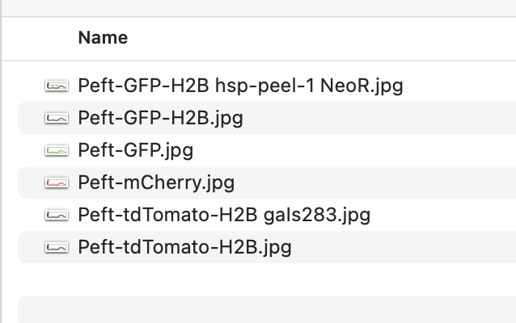

# SoMarker GUI Tool

---

## How to use

### I. Download SoMarker

1. Click on the version number under Releases

2. Download SoMarker which is compatible with your operating system

### II. Launch SoMarker

#### For mac users: 

Install the app by using the dmg file. Because we are not an Apple identified developer, you will encounter a warning message when you try to open the app. We apologise for the inconvenience.

To open the app:

1. Choose Apple menu > System Settings, then click **Privacy & Security** in the sidebar.
2. Scroll down the page of Privacy & Security until you find the message “‘SoMarker’ was blocked from use because it is not from identified developer”
3. Click on “Open Anyway” and you won’t encounter this issue next time you use the app.

#### For windows users:

Decompress the app from the zip folder and save to your directory of choice. You can launch SoMarker by clicking on SoMarker.exe without installation.

We didn’t encounter any warning message from Windows 11 when we tested the app. But if you see the warning message in other Windows OS, please follow the instructions of Windows to open the app.

### III. Using SoMarker

1. Select the type of marker desired.
2. Search for marker strains by either entering in a gene name or a chromosome of interest with a specific genetic position.

### IV. Editing the gene and marker databases of SoMarker

We developed an Import/Export tool to simplify the process of editing the gene and marker databases. This will allow the user to add, delete or modify the information within SoMarker.

1. Choose the Import/Export Tool tab on the sidebar.
2. Click on the button “Export XLSX Data” corresponding to the information that the user wishes to edit (Gene, Fluorescent Marker, or Phenotypic Marker). Follow the prompt and save the spreadsheet to a directory of choice.
3. Within the spreadsheet, add/delete/edit the information (keep the order of columns unchanged).
4. Import the modified spreadsheet into SoMarker by clicking the button “Choose XLSX File” corresponding to the information that the user wishes to update(Gene, Fluorescent Marker, or Phenotypic Marker).

**Fluorescent markers:**

**Phenotypic markers:**

**Genes**

## V. Adding images to SoMarker

To add images to SoMarker that correspond to a fluorescent marker:

1. Click on “Open” button to open image folder under the “Import/Export Tool” tab.

2. Add images in jpeg format to the folder

3. To link the images to the corresponding fluorescent marker strains, add the filename of the new image to the “Image” column of the fluorescent marker spreadsheet (see instructions above (section III) for editing this spreadsheet).

4. Import the edited spreadsheet back into the SoMarker following the instruction in section III.